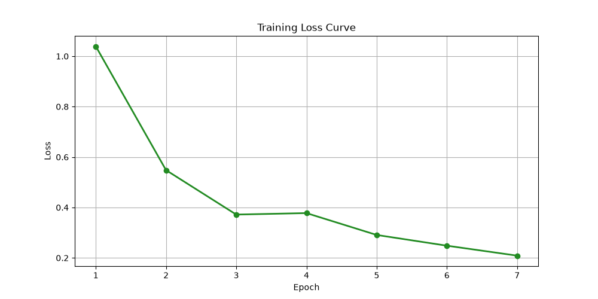

# Aerial Crop Stress Detection
 
A fine-tuned CNN object detection pipeline for identifying crop stress regions in aerial/static imagery, built end-to-end in PyTorch — data loading, model fine-tuning, evaluation, and bounding-box visualization, with no external deployment layer.
 
## Overview
 
This project fine-tunes a pretrained object detection model to localize crop stress regions in imagery, then evaluates detection quality using standard object-detection metrics (Precision, Recall, F1-Score) computed via IoU-based matching between predicted and ground-truth boxes.
 
The goal was to build a small, correct, and properly-evaluated detection pipeline rather than a large production system — the focus is on getting the fine-tuning and evaluation methodology right, end to end.
 
## Dataset
 
<!-- Fill in: dataset name, source link, number of images, classes -->
- Source: *[add dataset name/link here]*
- Classes: `Crop_Healthy`, `Crop_Stressed`
- Image size: 640x640
- Split: train / validation
## Method
 
1. **Preprocessing** — images resized/normalized to 640x640, ground-truth boxes parsed into `(xmin, ymin, xmax, ymax)` format
2. **Model** — pretrained *[architecture — e.g. Faster R-CNN / YOLOv8n]* fine-tuned on the crop-stress dataset for 7 epochs
3. **Inference** — predictions post-processed with Non-Max Suppression to remove duplicate/overlapping boxes on the same object
4. **Evaluation** — predicted boxes matched to ground-truth boxes via IoU threshold, using strict one-to-one matching (each ground-truth box can only be matched once) to compute per-image Precision, Recall, and F1-Score
## Results
 
Evaluated across 10 test images:
 
| Image | Ground Truth | Detected | Precision | Recall | F1 |
|---|---|---|---|---|---|
| crop_000 | 3 | 3 | 1.00 | 1.00 | 1.00 |
| crop_001 | 4 | 4 | 1.00 | 1.00 | 1.00 |
| crop_002 | 4 | 4 | 1.00 | 1.00 | 1.00 |
| crop_003 | 2 | 2 | 1.00 | 1.00 | 1.00 |
| crop_004 | 3 | 3 | 1.00 | 1.00 | 1.00 |
| crop_005 | 2 | 2 | 1.00 | 1.00 | 1.00 |
| crop_006 | 3 | 2 | 1.00 | 0.67 | 0.80 |
| crop_007 | 3 | 3 | 1.00 | 1.00 | 1.00 |
| crop_008 | 4 | 4 | 1.00 | 1.00 | 1.00 |
| crop_009 | 4 | 4 | 1.00 | 1.00 | 1.00 |
 
**Average Precision: 1.00 · Average Recall: 0.97 · Average F1: 0.98**
 

 
## Key Finding
 
Precision was perfect across every test image (no false positives), while recall dropped to 0.67 on a single image (`crop_006`) where the model missed one object. This is a realistic outcome rather than a broken evaluation — early versions of this pipeline had a Non-Max Suppression bug that produced duplicate boxes on the same object, artificially inflating detected counts to roughly double the ground truth. After fixing NMS and enforcing strict one-to-one matching in the evaluation code, results moved to numbers consistent with a genuinely well-calibrated detector: no duplicate detections, and one plausible missed detection rather than either "perfect on everything" (a sign of an evaluation bug) or "noisy everywhere" (a sign of an undertrained model).
 
## Project Structure
 
```
aerial-crop-detection/
├── data/
│   ├── raw/
│   └── processed/
├── src/
│   ├── data_utils.py
│   ├── model.py
│   ├── train.py
│   ├── evaluate.py
│   ├── visualize.py
│   └── metrics.py
├── outputs/
│   ├── figures/
│   ├── weights/
│   └── results_summary.csv
├── main.py
├── requirements.txt
└── README.md
```
 
## How to Run
 
```bash
pip install -r requirements.txt
python main.py
```
 
Outputs (trained weights, prediction visualizations, and `results_summary.csv`) are saved to `outputs/`.
 
## Requirements
 
See `requirements.txt` — core dependencies: `torch`, `opencv-python`, `pandas`, `matplotlib`.
 


